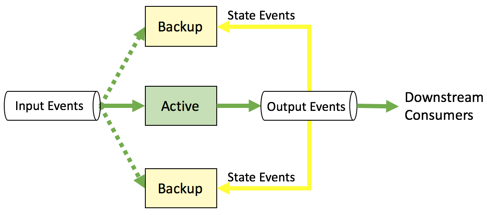

# solace-ha-demo

This is a sample application demonstrating a library built to provide 
_Event-Driven Applications_ the ability to operate in a Fault Tolerant manner 
via clustering. Candidate EDAs would typically consume an input stream of 
events, track some state, and produce an output stream of different events 
derived from that input stream. 

The HA library itself is designed to be reusable for any EDA problem involving 
state management, not just this particular application domain. In this example, 
a mock trade OrderBook engine listens for new buy or sell orders, tracks them 
all and outputs a `MarketStack` structure representing all input orders in 
relation to each other by price:

    [Orders] ---> [Matching Engine] ---> [MarketStack]

For applications like this, 90% of the job is to track all that state. If the 
application must be fault-tolerant then that means,

1. it must have multiple instances available to take over in the event of 
failure; and 
2. those instances must have the exact same state as the failed node if 
they do take over.

To meet these requirements this application library uses Solace's unique 
capabilities to provide a clustering model for fault-tolerant apps, a 
leader-election process to select the _ACTIVE_ member of the cluster, state 
synchronization for all members of the cluster and eventing to provide role 
updates and state updates. It does all this without complicated logic or any 
external components like a Zookeeper cluster.

Please note that the mock matcher itself is a contrived example, not a 
fully-functioning matching engine. It was built to demonstrate the library's 
HA state management capabilities based on a common real world use-case, so 
it's outputs and logic are skewed to emphasize those details rather than to be 
the best matching engine around. 

When leveraging this library to achieve fault tolerance all the application 
instances have to do is:

1. Handle HA events that tell it whether it is fulfilling an _ACTIVE_ or _BACKUP_ role 
2. Handle input `Order` messages when it is the _ACTIVE_ member, or 
3. Handle output `MarketStack` messages when it is a _BACKUP_ member to keep 
it's internal state synchronized with all it's peers.

You can start as many instances in the cluster as you like, Solace will elect 
the 'Leader' instance as the one whose output all other instances will follow, 
and provides that instance with an _ACTIVE_ event notification when it 
becomes leader, and a _BACKUP_ event when it becomes a follower.

The HA library starts with a `ClusterConnector` that connects to a Solace bus,
provisions all the necessary resources for listening to various message streams 
and handles all cluster state management. The application you write implements 
a `ClusterListener` interface that is passed into the `ClusterConnector` to be 
invoked on all clustering events.

```` Java
public interface ClusterEventListener<InputType, OutputType> {

    /**
     * HA State changes can include: Disconnected, Connected, Backup, Active
     */
    void OnHAStateChange(HAState oldState, HAState newState);

    /**
     * Sequence State changes can include: Connected, Bound, Following, UpToDate
     */
    void OnSeqStateChange(SeqState oldState, SeqState newState);

    /**
     * Called when an output message from the state-queue was read for recovery purposes
     */
    void OnStateMessage(OutputType state);

    /**
     * This is an important method called by the ClusterConnector when it calculates that
     * the cluster instance is up-to-date with the input stream, so every input requires
     * an updated state output.
     */
    OutputType UpdateApplicationState(InputType input);
}
````

## Events

Cluster events come in two kinds: message events, and state change events. 


### Message Events
There are only two possible kinds of message events, Input Messages and State Messages.

_Input Messages_ are messages of the `InputType` sent into the cluster;
only the ACTIVE member of the cluster ever receives them. Typically, each 
input event results on the ACTIVE member sending a matching output event.
** State Messages: these are messages of the `OutputType` produced by the 
ACTIVE member and consumed by all the BACKUP members. This allows them to 
keep their internal state synchronized.


### State Change Events

* _HA State Events_ are events relevant to HA membership; the most 
obvious and important states here are _ACTIVE_ and _BACKUP_ events
* _Sequence State Events_ are events relevant to processing any 
available State messages. It's very important for state management to know 
whether your _BACKUP_ instance is _UP_TO_DATE_ with the results from the _ACTIVE_ 
member or if it is still _RECOVERING_. For example, when it has to change 
from _BACKUP_ to _ACTIVE_ role it's internal state must have caught up to the 
last internal state from the previous _ACTIVE_ member.


## The `ClusterConnector`

The `ClusterConnector` connects to a Solace message-bus, provisions any required 
resources there and utilizes them for all communications. It is decoupled from 
your application's Input and Output data types via Generics so you can specify 
your own types and provide serialization methods to be invoked on all inputs/outputs.
The architecture employed look like this:



The topic for source input messages enqueues messages to the input queue, while 
a state queue per each instance is used to enqueue _output_ messages from 
peer instances. The input queue is an _Exclusive_ queue, meaning it only feeds 
messages to one consumer; all the other members remain bound to the input queue 
but they remain inactive and receive no input messages. The _ACTIVE_ member 
receives an event notifying it that it is _ACTIVE_, so it knows it is responsible 
for producing output messages. When the _ACTIVE_ member produces an output, it 
is automatically enqueued to the state queues of it's _BACKUP_ peers. The peers 
consume these messages to keep up-to-date with the latest state of the 
application as produced by the _ACTIVE_ member.

If the _ACTIVE_ member fails, Solace elects a new _ACTIVE_ member from the 
_BACKUP_ instances and sends it a notification of this state change. This 
is where the custom HA library takes over, managing consumption of any 
remaining outputs to be sure the new leader is synchronized to the last output 
before the failover. Then the library notifies the application of it's 
HA state change and starts the flow of input messages.

## Custom Serializer for Input and Output Messages

To decouple the eventing and clustering logic from the application logic, it 
cannot have any knowledge of the application's data format. This separation 
is achieved by passing opaque Serializer instances to the ClusterConnector 
that it can use to convert input and output types to the underlying transport 
serialization model. The serialization API is very simple and provides just 
enough for the HA library to get the data to the application in a format 
the app can use. 

Here's the interface:

```` Java
public interface ClusteredAppSerializer<InputType, OutputType> {

    InputType DeserializeInput(ByteBuffer msg);

    OutputType DeserializeOutput(ByteBuffer msg);

    ByteBuffer SerializeOutput(OutputType output);
}
````

Because the application only consumes input messages, you don't actually need 
to implement a `SerializeInput` method for those types. In practice, you'll 
probably want to implement one anyway for writing unit tests, test harnesses, 
drivers, etc. Since the `ClusterConnector` didn't actually require it, it 
wasn't added to the interface.

## Putting It All Together

```` Java
class TestHAApplication implements ClusterEventListener<Integer, Double> {
    private ClusterConnector<Integer,Double> _connector;
    private Integer _lastInput;
    private Double  _lastOutput;
    private int     _instance;
    private String  _outputTopic;
    private String  _stateQueue;

    public TestHAApplication(int instance, String outputTopic) {
        _instance    = instance;
        _outputTopic = outputTopic;

        _connector   = new ClusterConnector<Integer, Double>(this, new TestSerializer());
    }

    public void Start(String inputQueueName, String inputTopicName, String stateQueueName, String stateQueueTopic) {
        _stateQueue = stateQueueName;
        _connector.Connect(ConnectionFields.HOST,
                ConnectionFields.VPN,
                ConnectionFields.USER,
                ConnectionFields.PASS,
                "SampleApp" + _instance);
        _connector.BindQueues(inputQueueName, inputTopicName, stateQueueName, stateQueueTopic);
    }

    /** EVENT HANDLING  **/
    public void OnHAStateChange(HAState oldState, HAState newState) {
        System.out.println("From HA State: " + oldState + " to " + newState);
    }

    public void OnSeqStateChange(SeqState oldState, SeqState newState) {
        System.out.println("From Sequence State: " + oldState + " to " + newState);
    }

    public void OnStateMessage(Double state) {
        /**
         * HERE'S THE BACKUP APP'S JOB: track output from the ACTIVE member
         */
        System.out.println("State Payload from Peer: " + state);
        _lastOutput = state;
    }

    public Double UpdateApplicationState(Integer input) {
        /**
         * HERE'S THE REAL APPLICATION WORK: for each Innput, produce an output
         */
        _lastInput = input;
        _lastOutput = 1.1 * _lastInput;
        System.out.println("PROCESSING: " + _lastInput + " => " + _lastOutput);
        _connector.SendOutput(_outputTopic, _lastOutput);
        return _lastOutput;
    }
}

class TestSerializer implements ClusteredAppSerializer<Integer,Double> {
    private final ByteBuffer _outbuff = ByteBuffer.allocate(10);
    private final ByteBuffer _inbuff = ByteBuffer.allocate(10);

    public ByteBuffer SerializeOutput(Double output) {
        _outbuff.clear();
        _outbuff.putDouble(output);
        return _outbuff;
    }

    public Double DeserializeOutput(ByteBuffer msg) {
        return msg.getDouble();
    }

    public Integer DeserializeInput(ByteBuffer msg) {
        return msg.getInt();
    }
}

````

